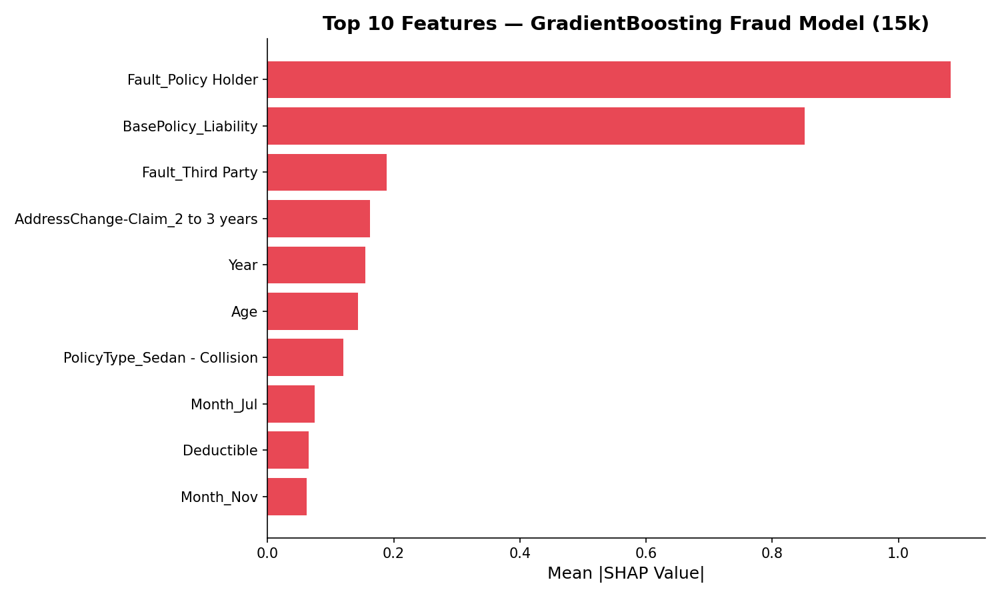
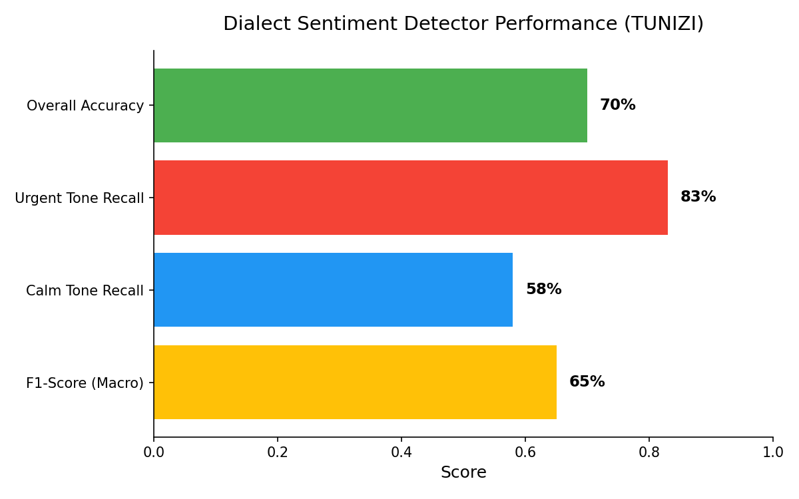
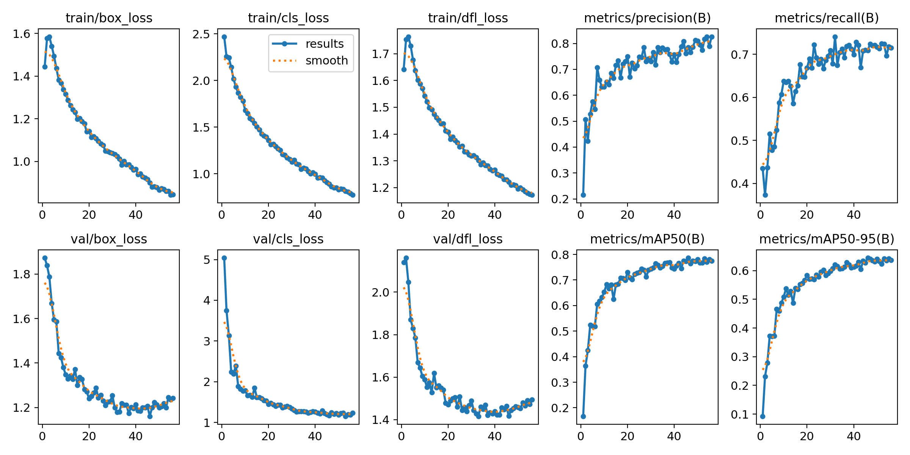
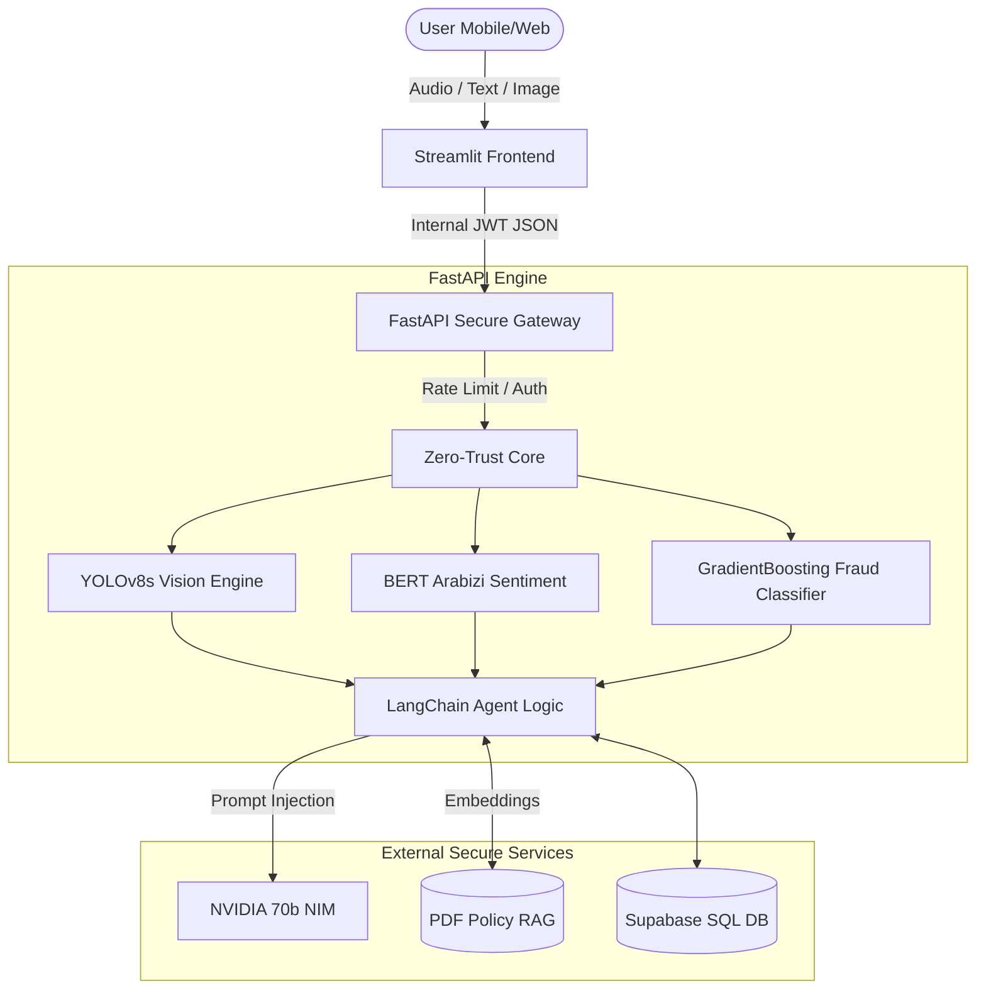

# 🛡️ Project Imani: Zero-Trust Autonomous Insurance Agent
Built for the OLEA Insurance Hackathon 2026

Project Imani is an enterprise-grade, localized AI insurance agent designed specifically for the North African market. It bridges the gap between state-of-the-art Generative AI and strict corporate cybersecurity compliance.

Imani isn't just a chatbot; she is a True Decoupled Microservice Architecture protected by a custom API Gateway, featuring Zero-Trust Identity verification, GDPR-compliant PII masking, an anti-fraud Vision engine, and multi-dialect Voice Accessibility.

## ✨ Core Business Features
**🌍 Hyper-Localized NLP & "Jailbroken" Dialect:** Imani fluently communicates in Tunisian Arabic (Tounsi), Algerian (Dziri), and Moroccan (Darija). We implemented custom Prompt Engineering and Context Injection to bypass standard LLM guardrails, forcing the AI to use authentic local vocabulary (e.g., Karhba, Parchoc) instead of standard French.

**🎙️ Smart Voice Accessibility (STT/TTS):** Built for total financial inclusion. Features a custom STT Interceptor that catches and corrects MSA (Modern Standard Arabic) mis-transcriptions into local dialects (e.g., correcting Kahraba to Karhba). Audio responses are dynamically routed: Imani only speaks out loud if the user initiated the conversation via voice.

**📸 Anti-Fraud Vision AI (NVIDIA NIM):** Users upload crash photos directly in the UI. The system features a Double-Gate Vision Pipeline:
- **Watermark Trap:** Simulates C2PA/SynthID metadata scanning to instantly catch and flag AI-generated deepfakes.
- **NVIDIA 90B Vision API:** Authentic photos are securely encoded in Base64 and sent to `meta/llama-3.2-90b-vision-instruct` via NVIDIA's enterprise endpoints for a granular, automated financial loss estimation.

**🧠 RAG-Powered Knowledge:** Powered by LangChain, ChromaDB, and Llama-3.1-70b-instruct, Imani reads actual OLEA policy PDFs to answer complex insurance queries with zero hallucinations.

**📱 WhatsApp-Native UX & Live Demoing:** The Streamlit frontend is custom-styled to mimic WhatsApp Web, featuring official OLEA branding and a Live QR Code integration, allowing stakeholders to seamlessly scan the screen and test the app on their own mobile devices.

## 🧠 Custom ML Architecture & Metrics (MLOps)

This project leverages dedicated ML models to provide a true "AI Brain" alongside strict security monitoring.

### 1. The Fraud Analyst (GradientBoosting)
Replaces hard-coded logic with a mathematical fraud probability model trained on 15,420 historical auto claims.
- **Algorithm:** `scikit-learn` GradientBoostingClassifier (15k Dataset)
- **Performance:** **ROC-AUC: 0.8385** | **Fraud Recall: 81%**
- **Integration:** When a user files a claim, the backend dynamically calculates the risk based on 30 standard features and injects the exact percentage into a Multi-Agent Debate powered by Llama 3. The LLMs argue whether to approve or flag the claim based on the mathematical risk.
- **Explainability:** Model features are mapped via SHAP analysis (Top driver: `Fault = Policy Holder`).



### 2. The Sentiment Detector (Arabic BERT)
A custom NLP pipeline tracking emotional distress in North African dialect (Arabizi).
- **Algorithm:** `CAMeL-Lab/bert-base-arabic-camelbert-da-sentiment` fine-tuned on the TUNIZI dataset.
- **Performance:** **Accuracy: 70%** | **Urgent Recall: 83%**
- **Integration:** Intercepts every chat message in 50ms. If the user is angry or in distress (e.g. "sayartiii tadharebtt!!"), it triggers a `CRISIS PROTOCOL` system prompt modifier, forcing the Llama 3 agent to respond with maximum empathy before technical advice. 



### 3. The Damage Assessor (YOLOv8s Vision)
A computer vision model trained to detect and localize specific car damages before the heavier VLM takes over.
- **Algorithm:** `ultralytics` YOLOv8s fine-tuned on the CarDD dataset.
- **Performance:** **mAP@50: 0.794** across 5 classes.
- **Integration:** Evaluates uploaded images and injects the precise localized damage classes into the Multimodal LLM prompt to ground repair estimates in robust objective data.



## 🔐 DevSecOps & Architecture
Imani operates within a "Privacy-by-Design" architecture. We abandoned monolithic structures for a True Decoupled Microservice approach, splitting the app into two isolated Docker containers (`frontend-agent` and `secure-api`).

### The System Pipeline (Mermaid)



### The Microservice Advantage:
- **Zero-Latency UI:** The Streamlit frontend contains zero Heavy AI logic or PyTorch imports. It boots in milliseconds and acts purely as a lightweight REST client, communicating with the backend via JSON over internal Docker networks.
- **Silent AI Booting:** The heavy ML models and RAG pipelines are isolated in the FastAPI Gateway, remaining silently alive in the background via Uvicorn.

### The Invisible Firewall:
- **Zero-Trust JWT Cryptography:** The AI Agent mathematically signs a dynamic JSON Web Token (JWT) that self-destructs every 60 seconds, preventing network interception.
- **Identity-Based Anti-DDoS:** Defeats IP spoofing. The rate limiter tracks the cryptographic User ID, dropping spam requests (max 1 claim per 5 seconds).
- **PII Masking (GDPR):** Sensitive info (e.g., USER123) is instantly masked (U***123) before touching system logs.
- **Immutable Audit Logging (SOC2):** Blocked attacks and approved claims are written to an immutable `audit.log`.

## 🛠️ Tech Stack
- **AI & NLP:** NVIDIA NIM Endpoints (Llama-3.1-70b-instruct, Llama-3.2-90b-vision-instruct), LangChain, HuggingFace Embeddings.
- **Voice & Vision:** Google SpeechRecognition, gTTS, zero-trust Base64 memory encoding.
- **Backend Gateway:** FastAPI, Pydantic, PyJWT, Python `requests`.
- **Frontend:** Streamlit, `audio-recorder-streamlit`.
- **Infrastructure:** Docker, Docker Compose, Host-Network bypasses, Ngrok Public Tunneling.

## 🚀 Installation & Deployment

### Prerequisites
- Docker Desktop installed and running.
- An NVIDIA API Key.
- Ngrok (for public mobile demoing).

### 1. Environment Setup
Create a `.env` file in the root directory and add your API key:
```env
NVIDIA_API_KEY=your_nvidia_api_key_here
```
Ensure your project contains a populated `insurance_data` folder with your relevant OLEA PDF documents.

### 2. The Clean Build (Lightning Fast)
The project includes a highly optimized `.dockerignore` file and a `requirements.txt` that forces the CPU-only version of PyTorch.

Open your terminal in the project folder and run:
```bash
docker-compose up --build
```
*Note: The `docker-compose.yml` explicitly maps ports `8000:8000` (FastAPI) and `8501:8501` (Streamlit) to bypass Windows WSL2 bridge network limitations.*

### 3. Usage & Public Mobile Tunnel
Once the containers spin up, you can access the app locally at http://localhost:8501.

**To deploy publicly for Judges/Stakeholders:**
Open a new terminal and run Ngrok, forcing the IPv4 loopback to bypass Windows Docker IPv6 errors:

```bash
ngrok http 127.0.0.1:8501
```

- Copy the generated `https://...ngrok-free.app` link.
- Generate a QR Code for this link and present it to the judges.
- Test Voice (STT) on your mobile device.
- Upload `fake_crash.jpg` to trigger the AI-Deepfake fraud trap, then upload a real crash photo to see NVIDIA's automated loss estimation in action!