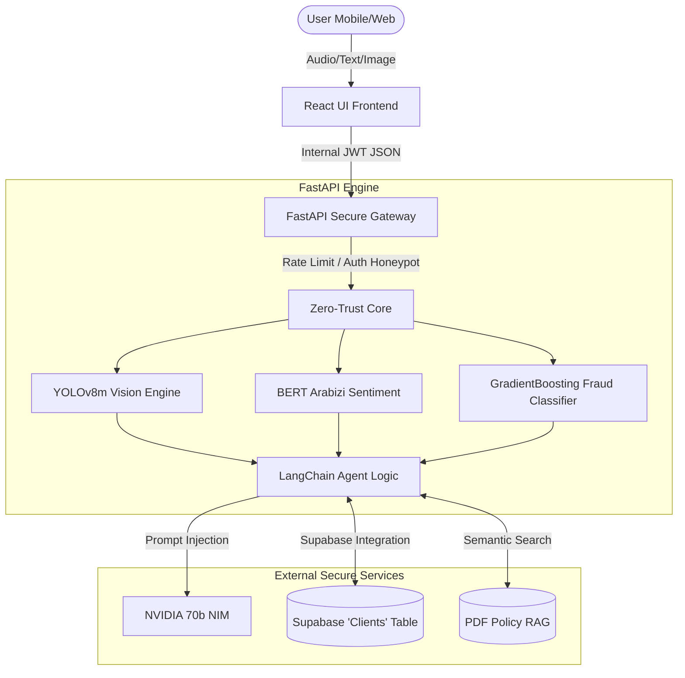

# 🛡️ Project Imani: The Autonomous Insurance Agent of the Future
**Built for the OLEA Insurance Innovation Hackathon 2026**

Project Imani is a paradigm shift in InsurTech. It is an enterprise-grade, fully autonomous AI agent designed specifically for the North African market. It bridges the critical gap between state-of-the-art Generative AI and strict corporate cybersecurity compliance.

Our goal was simple: **Replace the archaic web form with a sentient, secure, and culturally empathetic AI that settles claims in seconds, not weeks.**

---

## 🎯 The Commercial Pitch (For the Jury)

### The Problem
Insurance companies lose millions annually to three things:
1. **Operating Costs:** Paying human adjusters to manually read simple claims and PDF policies.
2. **Fraud:** Missing subtle deepfakes or historical patterns in claim submissions.
3. **Friction:** Customers abandoning complex clunky apps because they don't speak perfectly formal French or don't know how to navigate menus.

### The Imani Solution
Imani isn't just a chatbot; she is a **True Decoupled Microservice Architecture** protected by a custom API Gateway. 
- **For the Business:** She acts as an unbreakable firewall, a razor-sharp fraud analyst, and a 24/7 customer service agent that scales infinitely.
- **For the Customer:** She feels exactly like texting a friend on WhatsApp. She understands local slang, accepts voice notes, and assesses car damage instantly from a photo.

---

## ✨ Part 1: The Premium User Experience (UX/UI)
We entirely stripped away the generic structure of standard web apps to build an immersive, dynamic interface.

<details>
<summary><b>💼 Business Value:</b></summary>
Customers hate learning new UIs. By mimicking WhatsApp, we reduce the "Time-to-Value" to zero. If they know how to text, they know how to file an insurance claim.
</details>

- **WhatsApp-Native Dark Mode:** The frontend is custom-styled with surgical CSS (`:has()` selectors) to mimic a premium WhatsApp Web environment. We utilize a harmonious `#0B141A` dark mode tailored specifically to reduce eye strain.
- **Dynamic Interaction Pill:** Streamlit's default headers and rigid boxes were eliminated. User inputs, audio recorders, and file uploaders are embedded directly into a floating, unified bottom-bar "pill," creating a fluid, edge-to-edge application.
- **Seamless Localized Empathy:** Imani fluently communicates in Tunisian Arabic (Tounsi), Algerian (Dziri), and Moroccan (Darija). We applied custom Prompt Engineering and "Context Injection" to bypass standard LLM guardrails, forcing the AI to strictly use authentic local vocabulary (e.g., *Karhba, Parchoc*) instead of rigid MSA or standard French.

---

## 🔐 Part 2: The Enterprise Cybersecurity Gateway
Security is not an afterthought; it is the core architecture. We abandoned monolithic structures, splitting the app into two isolated Docker networks (`frontend-agent` and `secure-api`).

<details>
<summary><b>⚙️ Technical Deep Dive:</b></summary>
Imani operates within a "Privacy-by-Design" architecture. The UI contains <b>zero</b> AI logic. It acts strictly as a dumb REST client, securely tunneling JWT-encrypted payloads over Docker's internal bridged network to the <code>secure-api</code>, where the LLM models reside.
</details>

### 1. The Conversational "Zero-Trust Bouncer"
The AI Agent itself acts as the primary firewall. Before interacting with the database, the LLM intercepts the user via a strict **Onboarding Protocol**:
- **Authentication Loop:** The LLM refuses to answer insurance queries until it verifies an account. It seamlessly negotiates returning users for their credentials, hashes them securely via `bcrypt`, and cross-references them against our Cloud Database (Supabase).
- **Conversational Onboarding:** For new users, the AI politely collects 9 distinct fields (Age, Salary, Profession, etc.) *one-by-one*. Strict Pydantic validators (`age > 18`) ensure the LLM cannot be manipulated into injecting corrupted data.
- **Password Blindness:** We injected a *Prompt Firewall* ensuring the LLM never logs, repeats, or visually echoes user passwords back into the chat.

### 2. Network & Application Defense
- **The Intrusion Honeypot (Bot Trap):** We intentionally exposed a fake `/api/v1/database_dump` route. If an automated bot scans our server looking for vulnerabilities, the system instantly logs a *CRITICAL HONEYPOT BREACH* and permanently bans the IP (`HTTP 403`).
- **Identity-Based Anti-DDoS:** The API dynamically tracks cryptographic User IDs. If an attacker tries to spam claims, the server blocks them with an `HTTP 429 High Traffic Alert` (max 1 claim per 5 seconds).
- **Cryptographic Gateways & Timed JSON Web Tokens:** Every backend route is walled behind an unpredictable `INTERNAL_API_KEY`. JWTs generated by the Langchain agent self-destruct after exactly 60 seconds to mathematically nullify replay attacks.
- **GDPR PII Masking:** Sensitive User IDs (e.g., `USER123`) are irreversibly masked (`U***123`) before touching immutable SOC2-compliant system logs.

---

## 🧠 Part 3: Autonomous Reasoning & MLOps
Imani operates a diverse ecosystem of specialized Machine Learning models handling different modular tasks instantly.

### 1. The Multi-Agent Fraud Board (Machine Learning)
<details>
<summary><b>💼 Business Value:</b></summary>
Human fraud detection is slow and biased. By allowing a mathematical GradientBoosting model to calculate a non-biased percentage, and letting two AI personas debate the result, OLEA saves millions in fraudulent payouts while providing explainable proof.
</details>

- **The Core:** An `scikit-learn` GradientBoostingClassifier trained on 15,420 historical auto claims. (**ROC-AUC: 0.8385** | **Fraud Recall: 81%**).
- **The Execution:** When the algorithm flags a claim threshold (e.g., 73% risk), the entire system pauses. The backend dynamically spins up a **Multi-Agent Debate**. Two Llama-3 AI personas—an *Adjuster AI* and a *Fraud Analyst AI*—argue over the claim's legitimacy before rendering a final "Suspended for Human Review" verdict.


### 2. The Sentiment Crisis Protocol (NLP)
- **The Core:** `CAMeL-Lab/bert-base-arabic-camelbert-da-sentiment` fine-tuned on the TUNIZI dataset.
- **The Execution:** Intercepts every chat message in 50ms. If the user is angry or in distress (e.g., *"Sayartiii tadharebtt!!"*), it instantly triggers a `CRISIS PROTOCOL` modifier in the LLM's brain, forcing the agent to abandon technical jargon and respond with maximum emotional empathy.


### 3. The "Double-Gate" Vision Architecture
Imani processes crash photos securely using a tiered system to prevent spam and deepfakes:
- **Gate 1: The Local YOLO Guardrail** — A PyTorch vision model instantly scans for valid car components (Lamp, Tire, Glass). If it doesn't see a car, it blocks the API request to prevent abusing heavy Cloud bandwidth.
  - *Cloud MLOps Pipeline:* We engineered a custom, fail-proof Python pipeline (`train_vision.py`) on Kaggle to bypass Multi-GPU PyTorch DDP crashes, efficiently training the heavy `YOLOv8m` weights within a strict 16GB VRAM constraint.
- **Gate 2: NVIDIA Llama-3.2 Vision** — Once verified, the high-res image is sent to NVIDIA's 90B VLM to generate a nuanced, granular damage assessment in Tounsi dialect.


### 4. RAG-Powered Knowledge (Retrieval-Augmented Generation)
Imani hallucinates **nothing**. Utilizing LangChain and ChromaDB, the system ingests massive OLEA PDF policy documents. The AI is restricted to only answer questions based on mathematical semantic-search retrieval from actual legal policies, guaranteeing absolute factual accuracy.

---

## 🛠️ The System Pipeline Architecture (Mermaid)



---

## 🚀 Installation & DevSecOps Deployment
We massively optimized the deployment footprint. By aggressively tuning the `.dockerignore` file, we forcibly stripped massive legacy dataset bloat (`/train`, `/valid`, `*.zip`), shrinking the system memory footprint to an ultra-lean 1.8GB build consisting primarily of necessary PyTorch bindings and the `python:3.10-slim` OS.

### Prerequisites
- Docker Desktop.
- NVIDIA API Key & Supabase Project Keys.
- Ngrok (for public mobile demoing).

### 1. The Clean Build
Open your terminal in the project folder and run:
```bash
docker-compose up --build -d
```

### 2. Live Public Tunnels
Once the containers spin up, you can access the app locally at `http://localhost:8501`.

**To deploy publicly for Judges/Stakeholders:**
Open a new terminal and run Ngrok, forcing the IPv4 loopback to bypass Windows Docker IPv6 errors:
```bash
ngrok http 127.0.0.1:8501
```
- Distribute the generated `https://...ngrok-free.app` link.
- Test the conversational Cybersecurity Onboarding gate!
- Upload `fake_crash.jpg` to test the Fraud Trap, or upload a real crash photo to trigger the NVIDIA 90B Vision API.